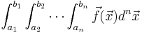
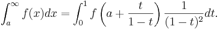
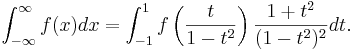

Cubature
--------

This is a simple C
package for **adaptive multidimensional integration** (*cubature*) of
**vector-valued integrands** over **hypercubes**, written by
[Steven G. Johnson](http://math.mit.edu/~stevenj).  That is, it computes
integrals of the form:



(Of course, it can handle scalar integrands as the special case where
f is a one-dimensional vector: the dimensionalities of f
and x are independent.) The integrand can be evaluated for an
**array of points at once** to enable **easy parallelization**. The
code, which is distributed as **free software** under the terms of the
[GNU General Public License](w:GNU_General_Public_License "wikilink")
(v2 or later), implements two algorithms for adaptive integration.

The first, *h*-adaptive integration (recursively partitioning the
integration domain into smaller subdomains, applying the same
integration rule to each, until convergence is achieved), is based on
the algorithms described in:

-   A. C. Genz and A. A. Malik, “An adaptive algorithm for numeric
    integration over an N-dimensional rectangular region,” *J. Comput.
    Appl. Math.* **6** (4), 295–302 (1980).
-   J. Berntsen, T. O. Espelid, and A. Genz, “An adaptive algorithm for
    the approximate calculation of multiple integrals,” *ACM Trans.
    Math. Soft.* **17** (4), 437–451 (1991).

This algorithm is **best suited for a moderate number of dimensions**
(say, < 7), and is superseded for high-dimensional integrals by other
methods (e.g. [Monte Carlo](w:Monte_Carlo_integration "wikilink")
variants or [sparse grids](w:Sparse_grid "wikilink")).

(Note that we do *not* use any of the original DCUHRE code by Genz,
which is not under a free/open-source license.) Our code is based in
part on code borrowed from the [HIntLib numeric-integration
library](http://mint.sbg.ac.at/HIntLib/) by Rudolf Schürer and from code
for Gauss-Kronrod quadrature (for 1d integrals) from the [GNU Scientific
Library](http://www.gnu.org/software/gsl/), both of which are free
software under the GNU GPL. (Another free-software multi-dimensional
integration library, unrelated to our code here but also implementing
the Genz–Malik algorithm among other techniques, is
[Cuba](http://www.feynarts.de/cuba/).)

The second, *p*-adaptive integration (repeatedly doubling the degree of
the quadrature rules until convergence is achieved), is based on a
tensor product of [Clenshaw–Curtis quadrature](https://en.wikipedia.org/wiki/Clenshaw%E2%80%93Curtis_quadrature) rules. This
algorithm is often superior to *h*-adaptive integration for
[smooth](https://en.wikipedia.org/wiki/Smoothness) integrands in a few (≤ 3)
dimensions, but is a poor choice in higher dimensions or for non-smooth
integrands.

For the most part, the *p*-adaptive routines below are drop-in
replacements for the *h*-adaptive routines, with the same arguments
etcetera, so you can experiment to see which one works best for your
problem. One difference: the *h*-adaptive routines do *not* evaluate
the integrand on the boundaries of the integration volume, whereas the
*p*-adaptive routines *do* evaluate the integrand at the boundaries.
This means that the *p* adaptive routines require more care in cases
where there are singularities at the boundaries.

I am also grateful to Dmitry Turbiner (dturbiner ατ alum.mit.edu), who
implemented an initial prototype of the “vectorized” functionality (see
below) for evaluating an array of points in a single call, which
facilitates parallelization of the integrand evaluation.

Download
--------

The current version of the code can be downloaded from
[github repository](https://github.com/stevengj/cubature).

Either way, you get a directory containing stand-alone `hcubature.c` and `pcubature.c` files
(along with a couple of private header files) that you can compile and
link into your program for h-adaptive and p-adaptive integration,
respectively, and a header file `cubature.h` that you `#include`, as
described below.

The `test.c` file contains a little test program which is produced if
you compile that file with `-DHCUBATURE` or `-DPCUBATURE` and link with
`hcubature.c` or `pcubature.c`, respectively, as described below.

B. Narasimhan wrote a [GNU R](w:GNU_R "wikilink") interface, which can
be downloaded here:
[<http://cran.r-project.org/web/packages/cubature/index.html>](http://cran.r-project.org/web/packages/cubature/index.html).

A [Julia](http://julialang.org/) interface can be obtained from
[Cubature.jl](https://github.com/stevengj/Cubature.jl). A Python
[cubature.py interface](https://github.com/saullocastro/cubature)
written by Saullo Castro is also available.

Usage
-----

You should compile `hcubature.c` and/or `pcubature.c` and link it with
your program, and `#include` the header file `cubature.h`.

The central subroutine you will be calling for h-adaptive cubature is:

```c
int hcubature(unsigned fdim, integrand f, void *fdata,
              unsigned dim, const double *xmin, const double *xmax, 
              size_t maxEval, double reqAbsError, double reqRelError,
              error_norm norm,
              double *val, double *err);
```

or `pcubature` (same arguments) for p-adaptive cubature. (See also the
vectorized interface below.)

This integrates a function F(x), returning a vector of FDIM integrands,
where x is a DIM-dimensional vector ranging from XMIN to XMAX (i.e. in a
hypercube XMINᵢ ≤ xᵢ ≤ XMAXᵢ).

MAXEVAL specifies a maximum number of function evaluations (0 for no
limit). (Note: the actual number of evaluations may somewhat exceed
MAXEVAL: MAXEVAL is rounded up to an integer number of subregion
evaluations.) Otherwise, the integration stops when the estimated
|error| is less than REQABSERROR (the absolute error requested) **or**
when the estimated |error| is less than REQRELERROR × |integral value|
(the relative error requested). (Either of the error tolerances can be
set to **zero to ignore** it.)

For vector-valued integrands (FDIM > 1), NORM specifies the norm that
is used to measure the error and determine convergence properties. (The
NORM argument is irrelevant for FDIM ≤ 1 and is ignored.) Given vectors
*v* and *e* of estimated integrals and errors therein, respectively, the
NORM argument takes on one of the following enumerated constant values:

-   `ERROR_L1`, `ERROR_L2`, `ERROR_LINF`: the absolute error is measured
    as |e| and the relative error as |e|/|v|, where |...| is the
    [L₁](https://en.wikipedia.org/wiki/Taxicab_geometry),
    [L₂](https://en.wikipedia.org/wiki/Euclidean_distance), or
    [L∞](https://en.wikipedia.org/wiki/Uniform_norm)
    [norm](https://en.wikipedia.org/wiki/Norm_(mathematics)), respectively. (|x| in the
    L₁ norm is the sum of the absolute values of the components, in
    the L₂ norm is the root mean square of the components, and in the
    L∞ norm is the maximum absolute value of the components)

-   `ERROR_INDIVIDUAL`: Convergence is achieved only when each integrand
    (each component of v and e) individually satisfies the requested
    error tolerances.

-   `ERROR_PAIRED`: Like `ERROR_INDIVIDUAL`, except that the integrands
    are grouped into consecutive pairs, with the error tolerance applied
    in an L₂ sense to each pair. This option is mainly useful for
    integrating vectors of complex numbers, where each consecutive pair
    of real integrands is the real and imaginary parts of a single complex
    integrand, and you only care about the error in the complex plane rather
    than the error in the real and imaginary parts separately.

`VAL` and `ERR` are arrays of length `FDIM`, which upon return are the
computed integral values and estimated errors, respectively. (The
estimated errors are based on an embedded cubature rule of lower order;
for smooth functions, this estimate is usually conservative.)

The return value of `hcubature` and `pcubature` is 0 on success and
nonzero if there was an error (mainly only out-of-memory situations or
if the integrand signals an error). For a nonzero return value, the
contents of the `VAL` and `ERR` arrays are undefined.

The integrand function `F` should be a function of the form:

```c
int f(unsigned ndim, const double *x, void *fdata,
      unsigned fdim, double *fval);
```

Here, the input is an array `X` of length `NDIM` (the point to be
evaluated), the output is an array `FVAL` of length `FDIM` (the vector
of function values at the point `X`). he return value should be 0 on
success or a nonzero value if an error occurred and the integration is
to be terminated immediately (`hcubature` will then return a nonzero
error code).

The `FDATA` argument of `F` is equal to the `FDATA` argument passed to
`hcubature`—this can be used by the caller to pass any additional
information through to `F` as needed (rather than using global
variables, which are not re-entrant). If `F` does not need any
additional data, you can just pass `FDATA` = `NULL` and ignore the
`FDATA` argument to `F`.

### “Vectorized” interface

These integration algorithms actually evaluate the integrand in
“batches” of several points at a time. It is often useful to have access
to this information so that your integrand function is not called for
one point at a time, but rather for a whole “vector” of many points at
once. For example, you may want to evaluate the integrand in parallel at
different points. This functionality is available by calling:

```c
int hcubature_v(unsigned fdim, integrand_v f, void *fdata,
                unsigned dim, const double *xmin, const double *xmax,
                unsigned maxEval, double reqAbsError, double reqRelError,
                error_norm norm, double *val, double *err);
```

(and similarly for `pcubature_v`). All of the arguments and the return
value are identical to `hcubature`, above, except that now the integrand
`F` is of type `integrand_v`, corresponding to a function of a different
form. The integrand function `F` should now be a function of the form:

```c
int f(unsigned ndim, unsigned npts, const double *x, void *fdata,
      unsigned fdim, double *fval);
```

Now, `X` is not a single point, but an array of `NPTS` points (length
`NPTS`×`NDIM`), and upon return the values of all `FDIM` integrands at
all `NPTS` points should be stored in `FVAL` (length `NPTS`×`FDIM`). In
particular, `x[i*ndim + j]` is the `j`-th coordinate of the `i`-th point
(`i<npts` and `j<ndim`), and the `k`-th function evaluation
(`k<fdim`) for the `i`-th point is returned in `fval[i*fdim + k]`.
(**Note**: the `fval` indexing is changed compared to the
`adapt_integrate_v` interface in previous versions.)

Again, the return value should be `0` on success or nonzero to terminate
the integration immediately (e.g. if an error occurred).

The size of `NPTS` will vary with the dimensionality of the problem;
higher-dimensional problems will have (exponentially) larger NPTS,
allowing for the possibility of more parallelism. Currently, for
`hcubature_v`, `NPTS` starts at 15 in 1d, 17 in 2d, and 33 in 3d, but as
`adapt_integrate_v` calls your integrand more and more times the value
of NPTS will grow. e.g. if you end up requiring several thousand points
in total, `NPTS` may grow to several hundred. We utilize an algorithm
from:

-   I. Gladwell, “Vectorization of one dimensional quadrature codes,”
    pp. 230–238 in *Numerical Integration. Recent Developments, Software
    and Applications*, G. Fairweather and P. M. Keast, eds., NATO ASI
    Series C203, Dordrecht (1987).

as described in the article “Parallel globally adaptive algorithms for
multi-dimensional integration” by [Bull and
Freeman](http://citeseerx.ist.psu.edu/viewdoc/summary?doi=10.1.1.42.6638)
(1994).

### Example

As a simple example, consider the Gaussian integral of the scalar
function f(x) = exp(-sigma |x|²) over the hypercube
[-2,2]³ in 3 dimensions. You could compute this integral via code
that looks like:

```c
#include <stdio.h>
#include <math.h>
#include "cubature.h"

int f(unsigned ndim, const double *x, void *fdata, unsigned fdim, double *fval) {
    double sigma = *((double *) fdata); // we can pass σ via fdata argument
    double sum = 0;
    unsigned i;
    for (i = 0; i < ndim; ++i) sum += x[i] * x[i];
    // compute the output value: note that fdim should == 1 from below
    fval[0] = exp(-sigma * sum);
    return 0; // success*
}
```

then, later in the program where we call `hcubature`:

```c
double xmin[3] = {-2,-2,-2}, xmax[3] = {2,2,2}, sigma = 0.5, val, err;
hcubature(1, f, &sigma, 3, xmin, xmax, 0, 0, 1e-4, ERROR_INDIVIDUAL, &val, &err);
printf("Computed integral = %0.10g +/- %g\n", val, err);
```

Here, we have specified a relative error tolerance of $10^{-4}$ (and no
absolute error tolerance or maximum number of function evaluations).
Note also that, to demonstrate the `fdata` parameter, we have used it to
pass the σ value through to our function (rather than hard-coding the
value of σ in `f` or using a global variable).

The output should be:

    Computed integral = 13.69609043 +/- 0.00136919

Note that the estimated *relative* error is 0.00136919/13.69609043 =
9.9969×10⁻⁵, within our requested tolerance of 10⁻⁴. The *actual*
error in the integral value, as can be determined e.g. by running the
integration with a much lower tolerance, is much smaller: the integral
is too small by about 0.00002, for an actual relative error of about
1.4×10⁻⁶. As mentioned above, for smooth integrands the estimated
error is almost always conservative (which means, unfortunately, that
the integrator usually does more function evaluations than it needs to).

With the vectorized interface `hcubature_v`, one would instead use:

```c
int f(unsigned ndim, unsigned npts, const double *x, void *fdata, unsigned fdim, double *fval) {
    double sigma = *((double *) fdata);
    unsigned i, j;
    for (j = 0; j < npts; ++j) { // evaluate the integrand for npts points
        double sum = 0;
        for (i = 0; i < ndim; ++i) sum += x[j*ndim+i] * x[j*ndim+i];
        fval[j] = exp(-sigma * sum);
    }
    return 0; // success
}
```

### Infinite intervals

Integrals over infinite or semi-infinite intervals is possible by a
[change of variables](w:Integration_by_substitution "wikilink"). This is
best illustrated in one dimension.

To compute an integral over a semi-infinite interval, you can perform
the change of variables x=a+t/(1-t):



For an infinite interval, you can perform the change of variables
x=t/(1-t²):



Note the [Jacobian](w:Jacobian_matrix "wikilink") factors multiplying
*f*(⋅⋅⋅) in both integrals, and also that the limits of the *t*
integrals are different in the two cases.

In multiple dimensions, one simply performs this change of variables on
each dimension separately, as desired, multiplying the integrand by the
corresponding Jacobian factor for each dimension being transformed.

The Jacobian factors diverge as the endpoints are approached. However,
if f(x) goes to zero at least as fast as 1/x², then the limit of
the integrand (including the Jacobian factor) is finite at the
endpoints. If your f(x) vanishes more slowly than 1/x² but still
faster than 1/x, then the integrand blows up at the endpoints but the
integral is still finite (it is an integrable singularity), so the code
will work (although it may take many function evaluations to converge).
If your f(x) vanishes only as 1/x, then it is not [absolutely convergent](https://en.wikipedia.org/wiki/Absolute_convergence) and much more care is
required even to define what you are trying to compute. (In any case,
the h-adaptive quadrature/cubature rules currently employed in
`cubature.c` do not evaluate the integrand at the endpoints, so you need
not implement special handling for |t|=1.)

Test program
------------

To compile a test programs, just compile `hcubature.c` and/or
`pcubature.c` along with the test program `test.c`, e.g. (on Unix or
GNU/Linux) via:

```
cc -o htest test.c hcubature.c -l
cc -o ptest -DPCUBATURE test.c pcubature.c -lm
```

The usage is then:

    ./htest <dim> <tol> <integrand> <maxeval>

where `<dim>` = #dimensions, `<tol>` = relative tolerance, `<integrand>` is
0–7 for one of eight possible test integrands (see below) and `<maxeval>`
is the maximum number of function evaluations (0 for none, the default).
Similarly for `ptest` (which tests the `pcubature` function).

The different test integrands are:

-   0: a product of cosine functions
-   1: a Gaussian integral of exp(-x²), remapped to [0,∞) limits
-   2: volume of a hypersphere (integrating a discontinuous function!)
-   3: a simple polynomial (product of coordinates)
-   4: a Gaussian centered in the middle of the integration volume
-   5: a sum of two Gaussians
-   6: an example function by Tsuda, a product of terms with near poles
-   7: a test integrand by Morokoff and Caflisch, a simple product of
    `dim`-th roots of the coordinates (weakly singular at the boundary)

For example:

    ./htest 3 1e-5 4

integrates the Gaussian function (4) to a desired relative error
tolerance of 10^–5^ in 3 dimensions. The output is:

```
3-dim integral, tolerance = 1e-05
integrand 4: integral = 1, est err = 9.99952e-06, true err = 2.54397e-08
#evals = 82203
```

Notice that it finds the integral after 82203 function evaluations with
an estimated error of about 10⁻⁵, but the true error (compared to the
exact result) is much smaller (2.5×10⁻⁸): the error estimation is
typically conservative when applied to smooth functions like this.
